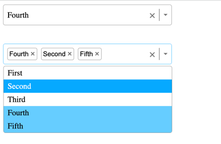

## Final Result
Build a select component with single and multiple selections, with the ability to handle keyboard event like: move up, down, escape, enter, ...

## Technologies

- This project is created with: `React`, `Typescript`, `Vite`

## Tutorial 

### Part 1: Generate basic HTML + CSS

Create the below design with HTML + CSS for single select component first.

### Part 2: Adding simple logic to display CSS & update value

- Consider the open/close state of options box
- To highlight option when we hover, we will prioritize handle the logic by JS and adding some CSS, since we want to handle keyboard event later

### Part 3: Add some more logic for Multiple Select option

- Adding new prop
- Update props type

### Part 4: Add keyboard events

- Using useEffect with the reference to select container to add event listener
- Clear the listener using clean up function

# New knowledge

- To be able to style `:focus` of `div` we must init `tabIndex`
- To check event when click of other area: `onBlur`
- `onMouseEnter` similar to hover, but for JS