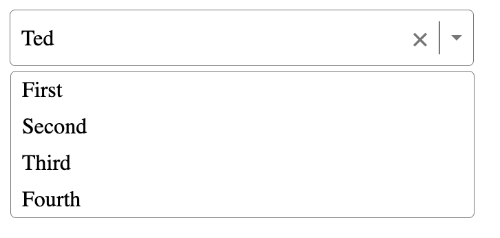

# Tutorial 

## Part 1: Generate basic HTML + CSS

Create the below design with HTML + CSS

## Part 2: Adding simple logic to display CSS & update value

# New knowledge

- To be able to style `:focus` of `div` we must init `tabIndex`
- To check event when click of other area: `onBlur`
- `onMouseEnter` similar to hover, but for JS